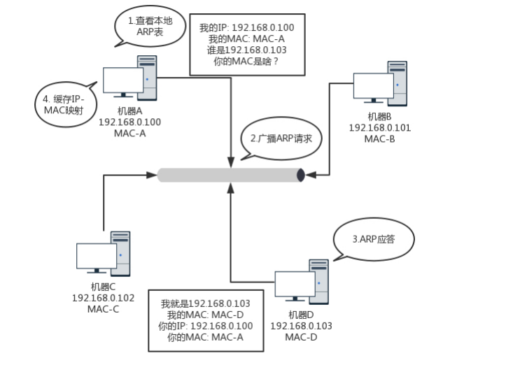

## ARP 协议
　　通过广播的方式来寻找目标 MAC 地址的，即已知 IP 地址，求 MAC 地址的协议。获取地址后，会使用缓存存放一段时间，这样就不用每次都要广播了。

### ARP 运作流程
　　以局域网为例，一个广播的网络列有 N 台机器，需要获知每台机器的 MAC 地址。
  
- 在一个局域网里，发送一个广播包，谁是这个 IP 的，就说出它的 MAC 地址；
- 这个广播包，会在局域网内传输；
- 当某台机器检查它的 IP 地址与广播包提的 IP 地址相同，就应答填上 MAC 地址；
- 由于广播包有源 IP 地址，这时应答机器同样将这个广播包进行传输，将源 IP 地址和目标 IP 地址进行对换即可；
- 为了避免每次都用 ARP 请求，机器本地也会进行 ARP 缓存。当然机器会不断地上线下线，IP 也可能会变，所以 ARP 的 MAC 地址缓存过一段时间就会过期。

