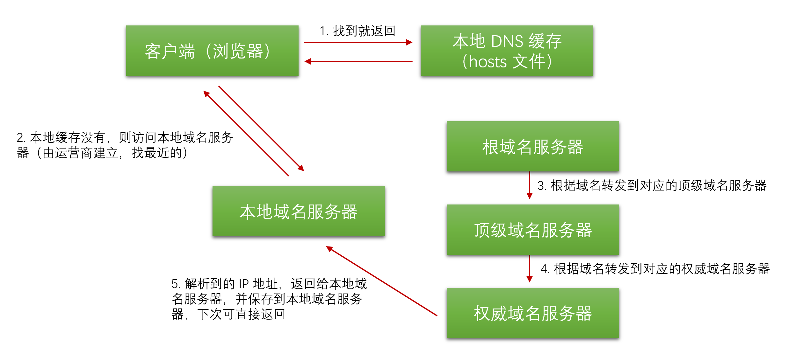

### 域名
　　以 "https://www.google.com/" 为例，使用 "." 进行分割，最右边的 "com" 为顶级域名，"google" 为二级域名，层级逐渐递减，"www" 为主机名。DNS 解析按照域名，从上到下分配对应的 DNS 服务器。域名解析可返回多个 IP 地址（主机），可做负载均衡。

### DNS 结构

- 顶层为根域名服务器，解析顶级域名，将域名转发给不同的顶级域 DNS 服务器的 IP 地址，比如根域名服务器解析到 "com"，转发给 "com" 下的顶级域名服务器，如果是 "cn"，则转发给 "cn" 下的顶级域名服务器；
- 第二层为顶级域名服务器，同上，解析到 "google"，则转发到 "google" 下的权威 DNS 服务器。解析到 "apple"，则转发到 "apple" 下的权威 DNS 服务器；
- 最后一层为权威域名服务器，这层是解析域名的，返回 IP 地址，前面两层是转发。转到 "google" 下的权威 DNS 服务器，负责解析 "google" 下的域名。转到 "apple" 下的权威 DNS 服务器负责解析 "apple" 下的域名。

### DNS 解析流程

　　DNS 解析需要将数据传输到 DNS 上，为了不让解析耗费在传输上，会就近部署 DNS 缓存服务器，大公司（Google 的 "8.8.8.8"）、网络运行商都会建立自己的 DNS 服务器。解析过程：

- 在客户端（如浏览器）输入一个域名（比如 https://www.google.com/ ），会先在本地的 hosts 文件查找是否有这个网址的映射关系，有就调用这个 IP 地址进行解析（很多破解的会在 hosts 填上映射关系，使得破解的练不上网，就无法检测了。另外早期的墙也是在检测到访问 google 时，随意给你一个 IP 使得你无法解析，访问不到），这样就可以访问了；
- 如果本地 hosts 文件没找到对应的映射关系，会发给本地域名服务器（本地 DNS，由网络服务商电信、移动等自动分配）；
- 本地 DNS 缓存了一张域名与 IP 地址对应的表格，找到域名，则返回 IP 地址；
- 本地 DNS 没找到，则会开始自上而下寻找。先访问根域名服务器，发现该地址后缀是 .com，转交给顶级域名服务器。根域名服务器不解析域名，而是根据地址后缀转发给不同的顶级域名服务器进行解析；
- 顶级域名服务器管理 .com、.net、.org 这些一级域名，同样的根据后缀 google.com 告诉某个权威 DNS 服务器的地址；
- 该权威 DNS 服务器负责解析该域名得到对应的 IP 地址，直接发给本地 DNS；
- 本地 DNS 在将 IP 地址返回给客户端，至此客户端通过这个 IP 地址完成访问。
