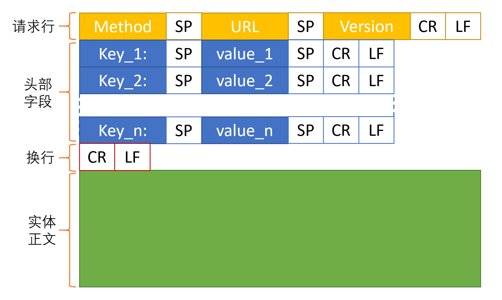
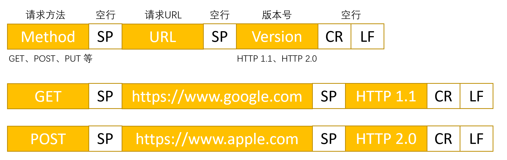

### HTTP 请求的结构
　　HTTP 的报文分为三部分，请求行（start line）、头部字段（header）和实体（body）。

### 请求行
　　由三部分组成，分比为请求方法、请求 URL、HTTP 版本。

- **请求方法。** HTTP 1.1 有八种请求方法，常用的有 GET、HEAD、POST、PUT 等；
    1. GET，只读操作（幂等）。客户端请求从服务器获取资源，比如图片、文本、视频、或者是 PHP 生成的页面等。可搭配其他头部字段，比如 Range，为请求部分资源；
    2. HEAD，只读操作（幂等）。GET 方法的简化版，服务端只返回响应头，不返回实体正文（body）。常用于检测一个文件是否存在、文件是否有新版本（对比响应头的文件修改时间）；
    3. POST，创建操作（不幂等）。客户端将信息放在 HTTP 实体正文中，传给服务端。只要向服务端传送数据，都可使用 POST；
    4. PUT，修改操作（不幂等）。修改服务端的资源。POST 和 PUT 区别在于，POST 是向服务端发送创建数据，PUT 是向服务端发送修改数据；
    5. DELETE，删除操作（幂等）。请求删除服务端资源，太危险，不常用，甚至禁止。
- **请求 URL。** 由 scheme（协议名）+ host（主机）:port（端口号）+ path（路径，用 "/" 分隔）+ ? + 查询参数（key=value），比如 https://www.google.com.hk/search?newwindow=1 ；
    1. scheme，协议名。比如 http、https、ftp 等，后接 "://"；
    2. host，主机名，可为 IP 地址或域名；
    3. port，端口号，可省略。HTTP 默认端口号为 80、HTTPS 为 443；
    4. path，文件路径。比如 xx/cc/ 这种形式，后接 ?；
    5. key=value，查询参数。比如 newwindow=1，key 为 newwindow，value 为 1；
    6. URL 中的特殊字符，会进行转义。比如空格转为 "%20"，中文会使用 UTF-8 编码后再转义。
- **HTTP 版本。** 比如 HTTP 1.1、HTTP 2.0 等。

### 头部字段
　　首部字段为 Key-Value，字段名为 Key，字段值为 Value。几个重要字段：

- Accept-Charset，告诉服务器客户端使用的编码字符集看，防止服务器返回使用其他编码，导致客户端解析不了，出现乱码；
- Content-Type，正文格式，常见的格式有 multipart/form-data、application/json、text/xml。一般使用 JSON 格式，即 Content-Type=application/json，实际根据场景需要选择；
- Range，指定请求资源的范围大小，比如一份 10000 字节大小的资源，使用 Range: bytes=5001-10000 表示请求 5001~10000 字节，用于下载中断后恢复下载。
- Cache-control，用于控制缓存。在高并发场景下，长时间不会变动的静态资源，比如图片等应该放在缓存中，防止每次请求都从服务器获取图片资源。另外，在大活动时，可通过模拟请求，预先将这些资源进行缓存。
    1. no-cache，先向服务器进行请求，如果没有变化，则使用缓存；
    2. no-store，请求和响应都禁止被缓存，每次都会向服务器发送请求，即不使用缓存；
    3. private，客户端可以使用缓存；
    4. public，客户端和代理器都可使用缓存；
    5. max-stale，缓存的内容将在 xxx 秒后失效，小于这段时间，则可以使用该缓存；
- Last-Modified，服务器在响应请求时，告诉浏览器资源的最后修改时间
- If-Modified-Since，与被请求资源的最后修改时间进行对比，资源修改时间小于 If-Modified-Since，则继续使用缓存，否则请求服务器获取最新修改的资源。

### 实体正文
　　客户端请求的正文内容。
