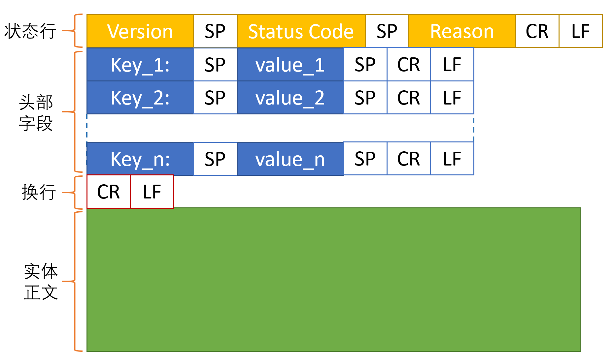
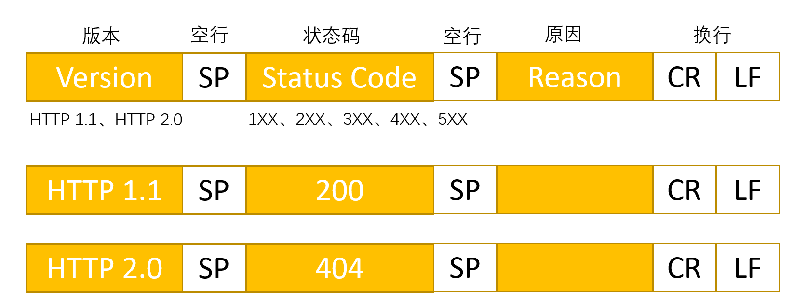

### HTTP 返回的结构

### 状态行
　　由三部分组成，分别为 HTTP 版本、状态码、原因组成。

- **HTTP 版本。** 比如 HTTP 1.1、HTTP 2.0 等；
- **状态码。** 由三位数字组成，数字第一位指定了响应类别，有 5 种响应类别，具体可看 [返回结果的 HTTP 状态码](https://github.com/martin-1992/Network-Protocol-Notes/blob/master/http_notebook/chapter_4/chapter_4.md)；
  1. 1XX，提示信息。表示接收的请求正在处理；
  2. 2XX，请求成功。表示请求正常处理完毕；
  3. 3XX，重定向。表示资源位置（URL）改变，需要客户端重新发送请求；
  4. 4XX，客户端的问题。表示服务器无法处理请求；
  5. 5XX，服务器的问题。表示服务器在处理请求时内部发生错误。
- **原因，** 补充状态码说明原因。

#### 2XX
　　请求正常。

- **200 OK。** 最常见的，表示一切正常；
- **204 No Content。** 同上，只是响应报文没有实体正文；
- **206 Partial Content。** 表示客户端进行范围请求，服务器成功执行这部分 GET 请求。比如请求部分资源、恢复还没下载完的资源，通常响应报文里除了 206 状态码还会加上头部字段 Content-Range，返回给客户端确认。表示服务器执行了部分请求，这部分以 Content-Range 范围为准。

#### 3XX
　　客户端请求的资源位置改变了，需要客户端重新发送到新的 URI 获取资源，即重定向。

- **301，永久重定向。** 网页地址已经永久改了，使用新的域名；
- **302，临时重定向。** 网页地址暂时改了，使用临时的新域名，以后会改回来；
- **304，缓存重定向。** 配合头部字段 If-Match，If-Modified-Since，If-None-Match，If-Range，If-Unmodified-Since 等任意一个头部字段使用。如果资源没有修改，就重定向到已缓存的文件。

#### 4XX
　　客户端发送的请求报文有问题，服务器无法处理该请求，客户端的问题。

- **400，请求报文存在语法错误。** 通用错误码，尽量避免使用；
- **403，禁止访问该页面。** 一般是没权限访问、信息敏感等；
- **404，找不到该页面。** 服务器找不到要请求的资源；

#### 5XX
　　服务器的问题，请求报文正确，但服务器在处理时出现错误。

- **500，服务器出错。** 同 400 类似，通用错误码，尽量避免使用；
- **501，客户端请求的功能，服务器暂不支持；**
- **503，服务器繁忙，暂时无法处理。** 通常是请求太多处理不过来，在响应报文里可加入一个头部字段 Retry-After，表示客户端在多久之后可再尝试发送请求访问服务器。

### 头部字段
　　返回的首部字段也是 Key-Value 形式，字段名 Content-Type，值可为 HTML 或 JSON，表示返回的格式。

### 实体正文
　　服务端根据请求返回的正文内容。
