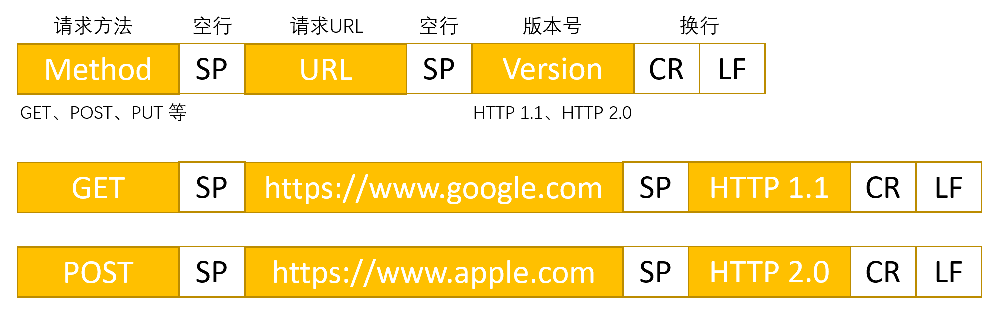

### HTTP 返回的结构

#### 状态行
　　版本为 HTTP 的版本，比如 HTTP 1.1。状态码表示客户端 HTTP 请求的返回结果，它是以 3 位数字和原因短语组成，数字中的第一位指定了响应类别。如 200 OK，表示请求被正常处理，响应类别分为 5 种。每种响应类别，具体可看[返回结果的 HTTP 状态码](https://github.com/martin-1992/Network-Protocol-Notes/blob/master/http_notebook/chapter_4/chapter_4.md)。

- 1XX，Informational（信息性状态码），表示接收的请求正在处理；
- 2XX，Success（成功状态码），表示请求正常处理完毕；
- 3XX，Redirection（重定向状态码），表示需要进行附加操作以完成请求；
- 4XX，Client Error（客户端错误状态码），表示服务器无法处理请求；
- 5XX，Server Error（服务器错误状态码），表示服务器处理请求出错。

#### 首部字段
　　返回的首部字段也是 Key-Value 形式，字段名 Content-Type，值可为 HTML 或 JSON，表示返回的格式。
