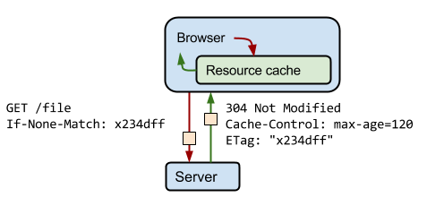

### ETag
　　响应头字段，资源的唯一标识，类似 hash，内容变了，hash 就变了。比如 ETag: "737060cd8c284d8af7ad3082f209582d"，用于解决通过修改时间 Last-modified 无法区分文件是否有变化的问题。 
　　因为 Last-Modified 的修改时间是达到秒级程度，如果在一秒内修改多次，则无法区分出来。另一种情况，类似 CAS 中的 ABA 情况，修改完了但是内容一样，但修改时间 Last-Modified 却变了。 

### If-None-Match
　　请求头字段，If-None-Match 和 ETag 是配合一起使用的，ETag 的值会保存到 If-None-Match。

- 服务端发送的 ETag 给客户端保存，客户端下次请求时，通过 If-None-Match 带上 ETag 的值。比如服务端发送响应头 ETag: "737060cd8c284d8af7ad3082f209582d"，客户端发送请求头 If-None-Match: "737060cd8c284d8af7ad3082f209582d"；
- 验证文件是否修改是在服务端进行的，即服务端会比对客户端发来的 ETag 和服务端当前的 ETag，不相等则是文件发生变化；
- 相等则是没有变化，服务端会返回 "304 Not Modified"，带上 Cache-Control: max-age=150，表示还可以延用 150 秒。

