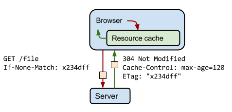

### [Accept、Content-Type]()
　　为数据类型字段，表示发送、接收的数据包类型。

- **请求头为 Accept，告诉服务端，客户端能够接收的内容类型，** 比如 Accept: image/png, text/html, application/xml 等；
- **响应头为 Content-Type，服务端返回该内容的 MIME 类型，** 比如 Content-Type: text/html; charset=utf-8。客户端看到 "text/html"，知道是 html 文件，会渲染出页面。

### Accept-Charset、Content-Type
　　表示数据编码的方式，常用的编码为 UTF-8、gbk，用于对消息正文进行编码。

### [Accept-Encoding、Content-Encoding]()
　　为数据压缩字段，用什么格式进行压缩。注意，视频、音频等文件已经是高压缩的，在使用 gzip 压缩就没什么意义，要使用响应头 Transfer-Encoding: chunk 进行分块发送。

- **请求头为 Accept-Encoding，客户端支持的压缩格式，** 比如 Accept-Encoding: gzip, deflate。没有该字段，则表示客户端不支持压缩数据；
- **响应头 Content-Encoding，服务端会选择一种压缩格式，** 放在响应头 Content-Encoding 中并返回，客户端根据选择的压缩格式进行解压。没有该字段，表示响应数据没有被压缩。

### Accept-Language、Content-Language
　　为数据语言字段，即客户端和服务端协商使用什么语言进行展示，比如中文 zh-Cn、英文 en 等。

- 请求头为 Accept-Language，表示客户端使用的语言，比如 zh-CN, en。服务端需返回 zh-CN 的页面，没有再返回 en 的页面；
- 响应头为 Content-Language，表示服务端返回数据包所使用的语言。

### [Range、Content-Range]()
　　为范围请求字段，**用于获取部分数据（文件一部分），比如跳过片头、多段下载、断点续传。**

- 请求头为 Range，是 HTTP 范围请求的专用字段；
    1. 比如 Range: bytes=500-999，表示获取子节在 500-999 之间的；
    2. 和分块传输区别在于，Range 可以获取部分数据（文件的一部分），而 Transfer-Encoding: chunked 是将大文件分成多个小文件传输，最终获取的还是一个整体的大文件。
- 响应头为 Content-Range，状态码为 206，服务端返回告诉客户端，实际的偏移量和总的数据大小。
    1. 比如 Content-Range: bytes 500-999/5000，表示实际偏移量为 500-999，总的数据大小为 5000；
    2. 该范围请求的字节内容是在消息正文中，发给客户端。

### [Cookie、Set-Cookie]()
　　让无状态的 HTTP 可以记忆，存储在客户端（浏览器）。

- 请求头字段 Cookie，响应头字段 Set-Cookie。Cookie 是服务端发给客户端，由客户端（浏览器）存储的；
- 然后，客户端在发送 HTTP 请求时，会把对应 Cookie 中的值也发送给服务端。

### [Cache-Control]()
　　请求头字段和响应头字段都有 Cache-Control，两边都可以使用，用于设定服务端和客户端的缓存控制。

### Via
　　请求头字段和响应头字段都有 Via，代理服务器用该字段来表明代理身份。当一个数据包经过一个代理服务器时，会在 Via 字端结尾追加该代理服务器的代理主机名或域名。 
　　比如客户端发送请求，经过两个代理，为 "Via: proxy1, proxy2"，当服务端回应时，则反过来为 "Via: proxy2, proxy1"。如果服务端要知道客户端的真实 IP 地址，使用 "X-Forwarded-For" 和 "X-Real-IP"。

- "X-Forwarded-For"，表示为谁而转发，形式上和 Via 差不多。每经过一个代理节点就会在字段里追加一个信息，区别是 Via 追加的是代理主机名或域名，X-Forwarded-For 追加的是请求方的 IP 地址，最左边就是客户端的 IP 地址；
- "X-Real-IP"，只记录客户端 IP 地址，没有中间的代理信息。

### [Last-modified、If-Modified-Since]()
　　为条件请求字段。

- **响应头字段，请求资源的最后修改时间，** 比如 Last-Modified: Tue, 15 Nov 2010 12:45:26 GMT；
- **请求头字段，表示该文件上一次修改的时间，** 配合响应头 Last-modified 一起使用，Last-modified 的值会保存到 If-Modified-Since。

### [ETag、If-None-Match]()

- **响应头字段 ETag，资源的唯一标识，** 类似 hash，内容变了，hash 就变了。比如 ETag: "737060cd8c284d8af7ad3082f209582d"，用于解决通过修改时间 Last-modified 无法区分文件是否有变化的问题；
- **请求头字段，If-None-Match 和 ETag 是配合一起使用的，** ETag 的值会保存到 If-None-Match。

### Connection: keepalive
　　请求头字段，HTTP/1.1 默认使用长连接 Connection: keepalive，Connection: close 为关闭长连接，使用短连接。短连接缺点是建立三次握手太耗时间和性能，使用长连接，即发送一次请求应答后不关闭连接，而是复用连接。 
　　长连接的缺点是，不关闭会占用服务端资源，如果有大量连接建立的话，会耗尽服务端资源。解决方法是设置长连接的超时时间，任何资源请求都因有超时，让资源能超时返回到资源池中。

### Location
　　响应头字段，配合 301（永久重定向）/ 302（临时重定向）使用。客户端解析到响应头中的字段 "Location:http://www.google.com"，则客户端会跳转到 "http://www.google.com"。

- 当前网址不可用，比如在维护，则临时跳转到维护页面。或者是域名变更，则永久跳转到新的域名；
- 双十一活动，需要服务降级时，当访问某个非核心业务页面时，则跳转到一个通知页面，让用户晚点在访问。

### Vary
　　告诉下游代理是使用缓存响应还是从原始服务器请求，相当于报文的一个版本标记。

- 同一个请求，经过内容协商后可能会有不同的字符集、编码、浏览器等版本。比如，"Vary: Accept-Encoding"、"Vary: User-Agent"，缓存代理必须要存储这些不同的版本。 
- 当再收到相同的请求时，代理就读取缓存里的 "Vary"，对比请求头里相应的 "AcceptEncoding"、"User-Agent" 等字段，如果和上一个请求的完全匹配，比如都是 "gzip"、"Chrome"，就表示版本一致，可以返回缓存的数据。

