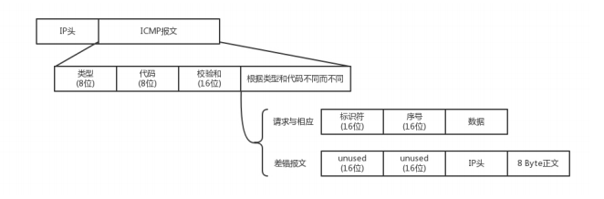

### ICMP 协议的格式
　　PING 是基于 ICMP 协议工作的，ICMP（Internet Control Message Protocol），即互联网控制报文协议。 
　　ICMP 报文是封装在 IP 包里，在遇到问题传输命令时，需要源地址和目标地址。

### IMCP 报文类型
　　主要介绍两种：
  
- **查询报文类型。** 主动请求对应 ICMP 的查询报文类型，ping 就是查询报文，并且获得主动应答的 ICMP 协议。对 ping 的主动请求，进行网络抓包，称为 ICMP ECHO REQUEST。主动请求的回复，称为 ICMP ECHO REPLY，这里多了两个字段，一个是标识符用于区分不同请求，另一个是序号，发送 N 个请求，收回多少个请求回复；
- **差错报文类型。** 包含几种类型：终点不可达为 3，源抑制为 4，时间超时为 11，路由重定向为 5。

### PING 流程
　　以同一个局域网内为例（同一个局域网，获取 MAC 地址只要使用 ARP 协议进行广播即可），主机 A 的 IP 地址是 192.168.1.1，主机 B 的 IP 地址是 192.168.1.2，在主机 A PING 主机 B 的流程，前面提到数据包是完整的，下层 HTTP 头和 HTTP 正文这些可以没有，但上层 IP 头和 MAC 头要有：
　　
- PING 命令执行时，源主机首先构建一个 IP 头，IP 头包含源 IP 地址、目标 IP 地址和 ICMP 的请求数据包，其中 ICMP 请求数据包包含多个字段，最重要的是类型字段和顺序号；
    1. 请求包的类型字段为 8，表示为主动请求；
    2. 顺序号用于区分连续 PING 的时候发出的多个数据包，并在报文的数据部分插入发送时间，用于计算往返时间。每发出一个请求数据包，顺序号自动加一。
- 加入 MAC 头，通过 ARP 映射表查找，找不到则使用 [ARP 协议](https://github.com/martin-1992/Network-Protocol-Notes/tree/master/ARP%20%E5%8D%8F%E8%AE%AE%E8%8E%B7%E5%8F%96%20MAC%20%E5%9C%B0%E5%9D%80)获取到对方的 MAC 地址。获得 MAC 地址后，数据包构建完成发送；
- 主机 B 的 MAC 层收到这个数据包后，进行层层拆封，先打开 MAC 头，检查 MAC 头中的目的 MAC 地址，如是发给本机则接收，否则丢弃；
- 主机 B 的 IP 层再检查 IP 头，发现 IP 地址匹配，是给本机的，发现有 ICMP 协议则进行提取（TCP 协议、UDP 协议同理）；
- 主机 B 会构建一个 ICMP 应答包发给主机 A；
    1. 其中类型字段为 0，表示为主动请求的应答；
    2. 顺序号为接收到的请求数据包中的顺序号。
- 主机 A 在规定时间内，没收到主机 B 发送的 ICMP 应答包，表示目标主机不可达；
- 主机 A 收到了主机 B 的应答包，用当前时刻减去该数据包上当初插入的发送时间，得出 PING 的时长，即 ICMP 数据包的时间延迟。

　　在同一局域网内，想要知道延迟，可直接 PING 对方主机。但如果不在一个局域网内，经过多个设备，需要逐个 PING 中间的这些设备，才能知道延迟出在哪处（设备），这需要有一个清晰的网络拓补图。如果中间设备禁止 PING，则需使用 telnet，通过其他协议来测试网络是否通畅。
