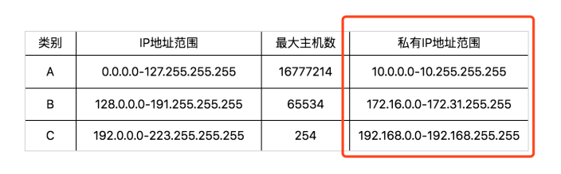

### IP 地址
　　分为 IPv4 和 IPv6 两种。
  
- 10.100.122.2，为 IPv4。该地址被点分隔为四个部分，每个部分 8 个 bit，所以 IP 地址总共是 32 位；
- inet6 fe80::f816:3eff:fec7:7975/64，为 IPv6，有 128 位。由于早期设计没考虑到 IPv4 会不够用，又设计了一种 IPv6。

#### 公有 IP 地址和私有 IP 地址
　　公有 IP 是需要购买的，具有唯一性，防止 IP 冲突（如果多个程序监听同一个 IP，会出现 IP 冲突，因为这个 IP 不知道该把数据包传给哪个应用程序）。私有 IP 则允许重复。比如公司会用私有 IP 分配，多个私有 IP 配一个公有 IP 的接口，最常见的私有 IP 地址是 192.168.0.x。

### MAC 地址

- 如 link/ether fa:16:3e:c7:79:75 brd ff:ff:ff:ff:ff:ff，称为 MAC 地址，是一个网卡的物理地址，用十六进制，6 个 byte 表示；
- MAC 地址是唯一的，像是一个身份证，具有唯一标识。但无法像 IP 地址那样，具有远程定位功能（即根据 IP 地址，即可把数据包发到该 IP 地址下）；
- MAC 的定位功能是只局限在一个子网里，比如从 192.168.0.2/24 访问 192.168.0.3/24 是可以用 MAC 地址的，但跨子网则需要使用 IP 地址。
