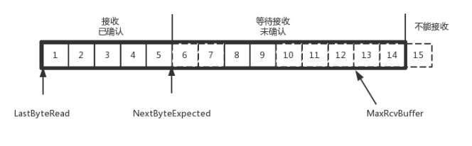

### 顺序问题与重传问题
　　在 [TCP 数据格式](https://github.com/martin-1992/Network-Protocol-Notes/blob/master/TCP%20%E5%8D%8F%E8%AE%AE/TCP%20%E6%95%B0%E6%8D%AE%E6%A0%BC%E5%BC%8F.md)中说到 TCP 协议为保证顺序性，会给每个包一个 ID。按照 ID 一个个发送。如果服务端在超过一定时间没有应答回复，则客户端会重新发送这个包，直到有回复。 
　　发包的 ID 是每隔四小时轮询完一次，不是每次建立连接都从 0 开始。这会出现上一次连接发送的包 3 还没回复，断开连接后，又从 0 开始，这时上一次断开连接的包 3 到达，服务端会认为是这次连接的包，所以发包的 ID 是累加的。 
　　同时对发送的包进行应答，是应答某个之前的 ID，而不是一个一个应答，称为累计确认或累计应答。比如 [1, 2, 3, 4, 7, 8]，应答 ID 为 4，表示 4 之前的包都收到了。 

#### 发送端的 TCP 协议序号
　　TCP 使用缓存来记录所有发送的包和接收的包，发送端的缓存按照包的 ID 一个个排列，根据处理情况分为 4 个部分：
  
- 发送了且已经确认的，可以丢弃；
- 发送了还没确认，等待回复；
- 没有发送，在等待发送；
- 没有发送，暂时也不会发送，拥塞控制。

　　如上为发送端的数据结构。TCP 的接收端会给发送端传一个窗口大小，叫 Advertised window，它是第二部分（发送了还没确认）加上第三部分（没有发送，在等待发送），即上图中黑色框住的部分。超过这个端口大小，接收端处理不过来。所以这个端口后面为第四部分，是暂时不会发送的。
  
- LastByteAcked，第一部分和第二部分的分界线；
- LastByteSent，第二部分和第三部分的分界线；
- LastByteAcked + AdvertisedWindow，第三部分和第四部分的分界线；

#### 接收端的 TCP 协议序号
　　接收端分为三部分：

- 接收了并已回复的；
- 还没接收，等待接收和回复；
- 还没接收，超过能接收的范围，不能接收。

　　如上为接收端的数据结构，其中 MaxRcvBuffer 表示最大缓存的量，NextByteExpected 表示第一部分（接收了并已回复的）和第二部分（还没接收，等待接收和回复）的分界线。 
　　针对重传问题，有两种方法。一种是超时重传，即在规定时间内没收到回复，则进行重传。另一种是快速重传，比如接收方收到了 [6, 8, 9] 的包，但没有 ID 为 7 的，于是发送三个 6 的回复（ACK），这样发送方知道 7 没收到，就立即重新发送，不用等超时。

### 流量控制问题
　　通过窗口来控制流量，假设窗口不变，窗口大小始终为 9。如下图，当 4 确认后，窗口会向右移一格，这时可发送 13。
  

　　如果发送端发太块，即把第三部分在等待发送的 10、11、12、13 都发送了，则第三部分为 0，没有未发送的。
  

#### 缩放流量窗口
　　当接收方处理不过来发送端的包时，通过修改窗口大小，或设为 0，使发送方暂时停止发包。 
　　比如，接收端在发送 6 的确认包，同时发送消息将窗口大小从 9 变为 8。发送端接收到 6 的确认包后，同时更改窗口大小，即只移动左边的框，表示已经收到 6 的确认回复。而右边的框不移动，则不会发送那些等待发送的包。
  

  
  
  这个新的窗口 8 通过 6 的确认消息到达发送端的时候，你会发现窗口没有平行右移，而是仅仅左面的边右移了，窗口的大小从 9 改成了 8。 
  如果接收端还是一直不处理数据，则随着确认的包越来越多，窗口越来越小，直到为 0。如下图，这时发送端会停止发送。 
  

