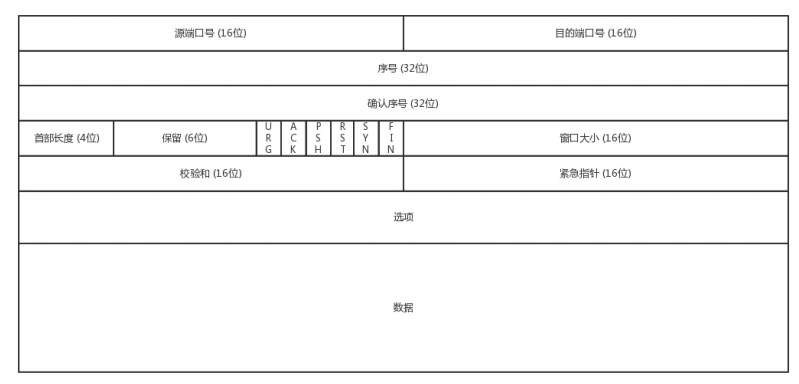

## TCP 数据格式
　　一个完整的数据包包含 [MAC 头，IP 头，TCP 头，HTTP 头，HTTP 正文]，TCP 头的数据格式是为了解决丢包、乱序、重传、拥塞、送达不了等问题：

- **源端口号和目标端口号， 通过端口号发给监听该端口号的应用程序；**
- **序号，给包编号是为了解决乱序问题。** 确认哪个包先来，哪个包后到，保证包的顺序一致。如果前面一个包没到，后面的包到了，则需等待前面一个包到了解析，才会处理下个包；
- **确认序号，解决丢包、重传问题。** 发出去的包要有确认回复，没收到，则会重新发送，直到确认收到；
- **校验和，确保数据包不被篡改。** 当收到数据包后，会检查数据包的校验和，如不一致，则数据包的校验和是被改动过的（P2P 下载，每一小块数据下载也有个校验和，确保下载的内容不被篡改）；
- **窗口大小，用于控制流量和拥塞控制。** 通信双方各声明一个窗口，标识自己当前能够的处理能力，别发送的太快，撑死我，也别发的太慢，饿死我。除了做流量控制以外，TCP 还会做拥塞控制，网络慢时，发包速度慢。
- **状态包，表示 TCP 的连接的状态。** 比如 SYN 是发起一个连接，ACK 是回复，RST 是重新连接，FIN 是结束连接等。双方通过使用这些包来维护连接的状态，以及状态的变更。

