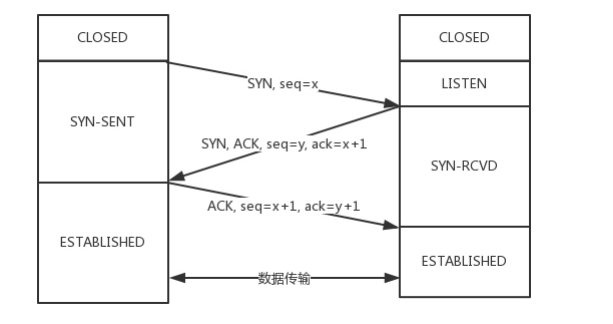

### 三次握手
　　TCP 的连接建立，称为三次握手，为 "请求 -> 应答 -> 应答之应答" 的三个回合。三次握手除了双方建立连接外，主要还是为了沟通 TCP 包的序号问题。 
　　比如 A 连上 B 后，发了 1、2、3 三个包，但第三个包丢失或绕路了，这时 A 掉线了，重新连上 B 后，如果序号还是从 1 开始的话，当到 3 时，上次连接发的 3 包刚好发给 B，B 则会认为是这次连接的下一个包，导致发生错误。 
　　为了防止这个错误，**每个连接都要有不同的序号，这个序号的起始序号是随时间变化的，可以看成一个 32 位的计数器，每 4ms 加一，需要 4 个多小时才会重新开始循环。** 当双方建立好连接后，需要维护一个状态机，在连接建立的过程中，双方的状态变化时序图如下图：

- 客户端发 SYN 给服务端，一次握手；
- 服务端确认，发 ACK，同时发 SYN 给客户端。二次握手，客户端对服务端通信确认；
- 客户端确认，发 ACK 给服务端。三次握手，服务端对客户端通信确认，至此两端确认完成可通信。

- 开始时，客户端和服务端都处于 CLOSED 状态；
- 先是服务端（某个应用程序）主动监听某个端口，处于 LISTEN 状态。在 [访问网页 IP 的流程](https://github.com/martin-1992/Network-Protocol-Notes/tree/master/%E8%AE%BF%E9%97%AE%E7%BD%91%E9%A1%B5%20IP%20%E7%9A%84%E6%B5%81%E7%A8%8B) 讲过，服务端通过拆分 [TCP 头](https://github.com/martin-1992/Network-Protocol-Notes/blob/master/TCP%20%E5%8D%8F%E8%AE%AE/TCP%20%E6%95%B0%E6%8D%AE%E6%A0%BC%E5%BC%8F.md)，获取端口号；
- 然后客户端主动发起一个完整数据包，其中该数据包的 TCP 头里的状态为 SYN，即发起一个连接，之后处于 SYN-SENT 状态；
- 服务端收到完整数据包，按照[拆分流程](https://github.com/martin-1992/Network-Protocol-Notes/tree/master/%E7%BD%91%E7%BB%9C%E5%88%86%E5%B1%82)，拿到 TCP 头。按照[封装过程](https://github.com/martin-1992/Network-Protocol-Notes/tree/master/%E7%BD%91%E7%BB%9C%E5%88%86%E5%B1%82)，返回 SYN，并 ACK 客户端的 SYN，之后处于 SYN-RCVD 状态；
- 客户端收到服务端发送的 SYN 和 ACK 之后，发送 ACK 的 ACK，之后处于 ESTABLISHED 状态，因为它一发一收已成功。到这里结束，算二次握手，即客户端确认服务端是连接的，但服务端要确认客户端是连接的还需三次握手；
- 服务端收到 ACK 的 ACK 之后，处于 ESTABLISHED 状态，因为它也一发一收了，完成三次握手。
