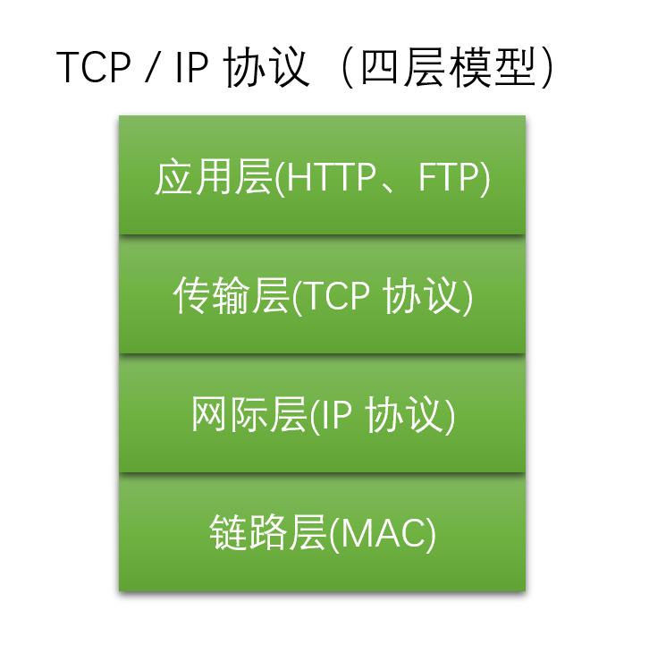
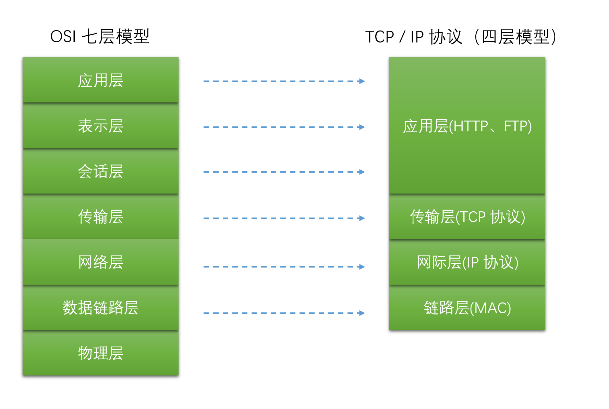

### TCP / IP 协议
　　**为多个网络通信协议的统称**，有四层。由下至上，分别为链路层、网际层（IP 协议）、传输层（TCP 协议）、应用层（HTTP 协议、FTP 协议等），缺一不可。 
　　核心为 TCP 和 IP，还包括 UDP、ICMP、ARP 等，构成一个有层次的协议栈，如下图。

- **第一层为链路层（MAC 层）。** 通过以太网、WIFI 等底层网络发送原始数据包，使用 MAC 地址来标记局域网的设备，也叫 MAC 层。这层是在局域网进行传输，属于网卡层次；
- **第二层为网际层（IP 层）。** 通过 IP 协议，使用 IP 地址，可跨局域网定位到某台机器设备。相当于将许多局域网连接成一个大的网络，即在一个互联网中定位某台机器；
    1. IP 协议是解决寻址和路由问题，以及如何在两点间传送数据包；
    1. MAC 地址是唯一的，在局域网里，没有远程定位功能，需要转为 IP 地址；
    2. IP 分为公有和私有，公有是唯一的，防止 IP 冲突。
- **第三层为传输层（TCP 层）。** 保证两台设备之间进行可靠传输；
    1. 通过 IP 协议定位到互联网中的某台机器设备后，通过 TCP 协议三次握手建立连接，然后传输数据；
    2. 除了 TCP 协议，还有 UDP 协议，都属于传输控制协议，两者的区别可看 ；
- **第四层为应用层（HTTP / FTP 等）。** 面向应用，传输数据，比如 HTTP、FTP 等。

### OSI 网络分层模型
　　该模型是用于统一各种网络协议，有 7 层。

- **第一层，物理层。** 指网卡、光纤这种网络的物理形式；
- **第二层，数据链路层。** 对应 TCP/IP 协议的链接层；
- **第三层，网络层。** 对应 TCP/IP 协议的网际层；
- **第四层，传输层。** 对应 TCP/IP 协议的传输层；
- **第五层，会话层。** 对应 TCP/IP 协议的应用层；
- **第六层，表示层。** 对应 TCP/IP 协议的应用层；
- **第七层，应用层。** 对应 TCP/IP 协议的应用层。

### 负载均衡

- 四层负载均衡，在 OIS 的第四层传输层，对 IP 地址、端口号进行负载均衡，一般是通过硬件来实现；
- 七层负载均衡，在 OSI 的第七层应用层，解析 HTTP 协议的报文数据（URI、主机名等），使用负载均衡策略转发给不同的机器设备，通常在代码中进行。

