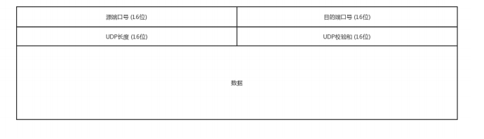

### UDP 头的数据结构
　　一个完整数据包为 [MAC 头，IP 头，UDP 头，HTTP 内容，HTTP 正文]。其中 UDP 头包含源端口、目标端口号、UDP 长度、UDP 校验和以及数据，如下图：
  

### UDP 的特点：
  
- 数据结构简单，没有大量的数据结构、处理逻辑、包头字段等；
- 不面向连接，谁都可以给它传数据，它也可以传给任何人数据；
- 只管发包，不管网络丢包、网络快慢等。

### UDP 的使用场景

- UDP 结构简单，所以需要的资源少。适合内网使用，或对于丢包不敏感的应用；
- 不面向连接，可以承载广播或多播的协议，比如 DHCP 是基于 UDP 协议的广播形式；
- 结构简单，处理快。适合在对处理速度有要求、时延低，且可容忍少数丢包的情况。

### 使用 UDP 的例子

- **网页或者 APP 访问。** 在移动中，TCP 容易断开重连，这时建立连接很耗时。并且目前 HTTP 协议，使用多个数据通道共享一个连接（RabbitMQ、Netty 也使用这种思想），加快传输速度。但 TCP 本身数据结构限制了如果前一个数据块没来，后面的数据块也要等着，加大了时延。QUIC 基于 UDP 改进的通信协议，用于快速建立连接、减少重传时延；
- **流媒体的协议。** 很多直播应用，都基于 UDP 实现了自己的视频传输协议。直播实时性比较重要，宁要丢包，也不要卡顿；
- **实时游戏。** 跟上面一样，对实时要求高；
- **IoT 物联网。** 同样，对实时要求高。另一方面，物联网领域终端资源少，比如内存非常小的嵌入式系统，这时使用简单的 UDP 协议，占用资源少；
- **移动通信领域。** 4G 网络里，移动流量上网的数据面对的协议 GTP-U 是基于 UDP 的。
