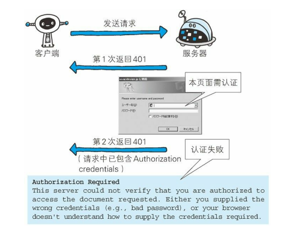

## 返回结果的 HTTP 状态码
　　HTTP 状态码负责表示客户端 HTTP 请求的返回结果、标记服务器端的处理是否正常、通知出现的错误等工作。状态码的职责是当客户端向服务器端发送请求时，描述返回的请求结果。借助状态码，用户可以知道服务器端是正常处理了请求，还是出现了错误。

### 状态码的类别
　　状态码以 3 位数字和原因短语组成，数字中的第一位指定了响应类别。如 200 OK，表示请求被正常处理，响应类别分为 5 种：

- 1XX，Informational（信息性状态码），表示接收的请求正在处理；
- 2XX，Success（成功状态码），表示请求正常处理完毕；
- 3XX，Redirection（重定向状态码），表示需要进行附加操作以完成请求；
- 4XX，Client Error（客户端错误状态码），表示服务器无法处理请求；
- 5XX，Server Error（服务器错误状态码），表示服务器处理请求出错。

### 2XX 成功
　　2XX 的响应结果表明请求被正常处理了。
  
- **200 OK，表示从客户端发来的请求在服务器端被正常处理了（请求成功）。** 在响应报文内，随状态码一起返回的信息会因方法的不同而发生改变。比如，使用 GET 方法时，对应请求资源的实体会作为响应返回；而使用 HEAD 方法时，对应请求资源的实体首部不随报文主体作为响应返回（即在响应中只返回首部，不会返回实体的主体部分）；
- **204 No Content，表示服务器接收的请求已成功处理，但在返回的响应报文中不含实体的主体部分（请求处理成功，但没有资源返回）。** 另外，也不允许返回任何实体的主体。比如，当从浏览器发出请求处理后，返回 204 响应，那么浏览器显示的页面不发生更新。一般在只需要从客户端往服务器发送信息，而对客户端不需要发送新信息内容的情况下使用；
- **206 Partial Content，该状态码表示客户端进行了范围请求，而服务器成功执行了这部分的GET 请求（对资源的部分请求，比如恢复还没下载完的资源）。** 响应报文中包含由 Content-Range 指定范围的实体内容。

### 3XX 重定向
　　3XX 响应结果表明浏览器需要执行某些特殊的处理以正确处理请求。
- **301 Moved Permanently，永久性重定向(网页地址改了，需使用新的域名)。** 该状态码表示请求的资源已被分配了新的 URI，以后应使用资源现在所指的 URI。 也就是说，如果已经把资源对应的 URI保存为书签了，这时应该按 Location 首部字段提示的 URI 重新保存。即资源的 URI 已经更新了，以前保存的 URI 没用，需更新保存新的；
- **302 Found，临时性重定向(网页地址暂时改了，需使用临时新的域名)。** 该状态码表示请求的资源已被分配了新的 URI，希望用户（本次）能使用新的 URI 访问。和 301 Moved Permanently 状态码相似，但 302 状态码代表的资源不是被永久移动，只是临时性质的。换句话说，已移动的资源对应的URI 将来还有可能发生改变。比如，用户把 URI 保存成书签，但不会像 301 状态码出现时那样去更新书签，而是仍旧保留返回 302 状态码的页面对应的 URI。即暂时需要使用新的 URI 访问，访问旧的 URI 就会出现302；
- **303 See Other，该状态码表示由于请求对应的资源存在着另一个 URI，应使用 GET 方法定向获取请求的资源（网页地址改了，需使用 GET 向新的域名获取请求资源）。** 303 状态码和 302 Found 状态码有着相同的功能，但 303 状态码明确表示客户端应当采用 GET 方法获取资源，这点与 302 状态码有区别。当 301、302、303 响应状态码返回时，几乎所有的浏览器都会把 POST 改成 GET，并删除请求报文内的主体，之后请求会自动再次发送；
- **304 Not Modified，该状态码表示客户端发送附带条件的请求时，服务器端允许请求访问资源，但未满足条件的情况（请求访问资源，但没有条件符合的响应资源）。** 304 状态码返回时，不包含任何响应的主体部分。304 虽然被划分在 3XX 类别中，但是和重定向没有关系。附带条件的请求是指采用 GET 方法的请求报文中包含 If-Match，If-ModifiedSince，If-None-Match，If-Range，If-Unmodified-Since中任一首部；
- **307 Temporary Redirect，临时重定向（跟 302 一样，加上禁止将 POST 变成 GET）。** 该状态码与 302 Found 有着相同的含义。尽管 302 标准禁止 POST 变换成 GET，但实际使用时大家并不遵守。307 会遵照浏览器标准，不会从 POST 变成 GET。但是，对于处理响应时的行为，每种浏览器有可能出现不同的情况。

### 4XX 客户端错误
　　4XX 的响应结果表明客户端是发生错误的原因所在。
- **400 Bad Request，该状态码表示请求报文中存在语法错误，服务端理解不了该请求。** 当错误发生时，需修改请求的内容后再次发送请求。另外，浏览器会像 200 OK 一样对待该状态码；
- **401 Unauthorized，该状态码表示发送的请求需要有通过 HTTP 认证（BASIC 认证、DIGEST 认证）的认证信息。** 另外若之前已进行过 1 次请求，则表示用户认证失败。当浏览器初次接收到 401 响应，会弹出认证用的对话窗口；

- **403 Forbidden，该状态码表明对请求资源的访问被服务器拒绝了（禁止访问该页面）。** 服务器端没有必要给出拒绝的详细理由，但如果想作说明的话，可以在实体的主体部分对原因进行描述，这样就能让用户看到了。未获得文件系统的访问授权，访问权限出现某些问题（从未授权的发送源 IP 地址试图访问）等列举的情况都可能是发生 403 的原因；
- **404 Not Found，该状态码表明服务器上无法找到请求的资源（找不到该页面）。** 除此之外，也可以在服务器端拒绝请求且不想说明理由时使用。

### 5XX 服务器错误
　　5XX 的响应结果表明服务器本身发生错误。
- **500 Internal Server Error，该状态码表明服务器端在执行请求时发生了错误（请求成功，但服务器端出错）。** 也有可能是 Web 应用存在的 bug 或某些临时的故障；
- **503 Service Unavailable，该状态码表明服务器暂时处于超负载或正在进行停机维护，现在无法处理请求（请求太多，处理不过来，服务繁忙）。** 如果事先得知解除以上状况需要的时间，最好写入 RetryAfter 首部字段再返回给客户端。
