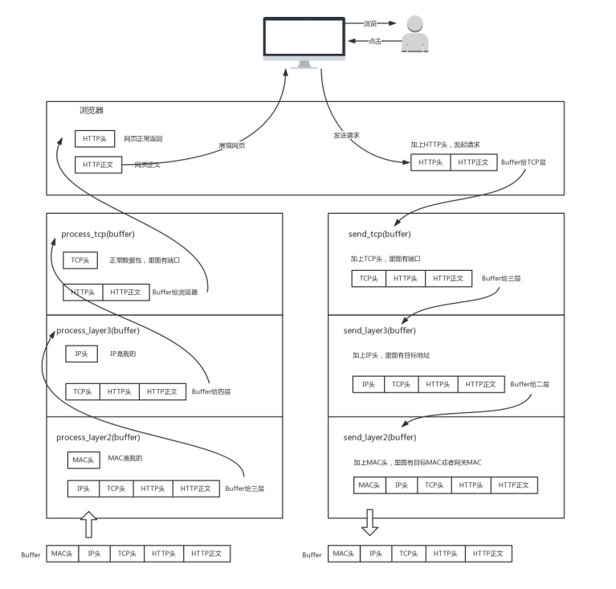

### 网络分层
　　在网络上传输的包，都是完整的。可以有下层没上层，绝对不可能有上层没下层。对于 TCP 协议来说，三次握手也好，重试也好，不是有 IP 地址，就可以发送了。只要是发出去的包，就要有 IP 层和 MAC 层，不然是发不出去的。

### 封装过程　
　　用户点击页面，浏览器会发起一个 HTTP 请求：

- Buffer 包含 HTTP 请求的内容（HTTP 头和 HTTP 正文）。这时 Buffer 为 [HTTP 头，HTTP 正文]，HTTP 头用于 HTTP 属性设置；
- 加上 TCP 头，记录下源端口号。目的端口号，是浏览器给的，一般为 80 端口。这时 Buffer 为 [TCP 头，HTTP 头，HTTP 正文]，TCP 头用于记录端口号；
- 加上 IP 头，记录源 IP 的地址和目标 IP 的地址（即要浏览的网页地址）。这时 Buffer 为 [IP头，TCP 头，HTTP 头，HTTP 正文]，IP 头用于记录 IP 地址；
- 加上 MAC 头，记录源 MAC 的地址和目标 MAC 的地址（如果不知道，会通过一定的协议处理找到，不能为空）。这时 Buffer 为 [MAC 头，IP头，TCP 头，HTTP 头，HTTP 正文]，MAC 头用于记录 MAC 地址；
- 经过层层封装，Buffer 数据包完整，可发送。
  

### 拆封过程
　　网口处理解析网络包的流程：

- 完整的网络包 Buffer，包含 [MAC 头，IP头，TCP 头，HTTP 头，HTTP 正文]；
- 先拆分 Buffer 中的 MAC 头，检查 MAC 头，看 MAC 地址是否相符，是则是发送给这个网口的。这时 Buffer 已拆掉 MAC 头，为 [IP头，TCP 头，HTTP 头，HTTP 正文]；
- 再拆分 Buffer 中的 IP 头，同样是检查 IP 头，看 IP 地址是否相符。这时 Buffer 已拆掉 IP 头，为 [TCP 头，HTTP 头，HTTP 正文]；
- 再拆分 Buffer 中的 TCP 头，根据 TCP 头中的端口，发给不同的应用。不同的应用监听不同的端口号。如果发现浏览器应用在监听这个端口，就发给浏览器。这时 Buffer 已拆掉 IP 头，为 [HTTP 头，HTTP 正文]；
- 监听该端口的浏览器获得 Buffer 中剩余的 HTTP 内容，经过层层拆封，解析显示出页面。

### 数据包解析
　　完整的网络包 Buffer，包含 [MAC 头，IP头，TCP 头，HTTP 头，HTTP 正文]。发出的请求会经过层层封装，解析的请求也是层层拆封。

- HTTP 头和 HTTP 正文，为 HTTP 内容；
- TCP 头，包含源端口和目标端口，用于将 HTTP 内容传给监听该端口的应用程序；
- IP 头，包含源 IP 和目标 IP 地址；
- MAC 头，包含源 MAC 地址和目标 MAC 地址。
