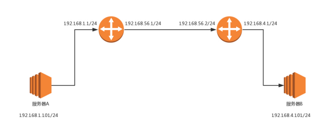
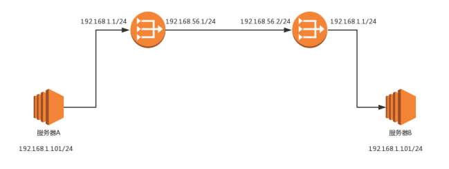

## 网页访问流程
　　在访问另一个网页 IP 时，先判断要访问的 IP 地址和当前机器的 IP 地址，是否为同一个网段，判断方法是通过 CIDR 和子网掩码。
  
- 如果为同一个网段，不需要网关，直接将源地址和目标地址放入 IP 头中，通过 ARP 协议获取 MAC 地址，将源 MAC 和目标 MAC 放入 MAC 头中，发送出去；
- 如果为不同网段，则需要先发往同一个网段的默认网关（MAC 头的 目标 MAC 地址为该网段的网关，而 IP 头为要访问的 IP 地址）。网关（通常是一个路由器）在接收到包后，把 MAC 头和 IP 头取下来，获取到 MAC 头的目标 MAC 地址（该网关地址，确认是发给这个网关的）和 IP 头的 IP 地址。根据路由算法，判断如果要想访问该目标 IP 地址，应该发往哪个局域网。然后加上 IP 头和 MAC 头，发送出去。

　　注意，MAC 地址是一个局域网内才有效的地址。如果 MAC 地址过了网关，即换了局域网，则该地址会改变。而 IP 地址有可变或不可变的，不改变 IP 地址的网关，称为转发网关。改变 IP 地址的网关，称为 NAT 网关。

### 访问不同网段的网页流程（MAC 变，IP 不变）

- 小明要访问 IP 地址为 192.168.4.101 的域名，小明所在的机器 IP 为 192.168.1.101。这两者属于不同的网段，所以小明要先访问他所在网段的网关，通过发送 ARP 协议可获取该网段的网关的 MAC 地址，然后把包发送过去；
>源 MAC：小明机器的 MAC； 
目标 MAC：192.168.1.1 这个网口的 MAC； 
源 IP：192.168.1.101； 
目标 IP：192.168.4.101；

- 包到达 192.168.1.1 这个网口，拆开 MAC 头，发现目标 MAC 和该网关的 MAC 一致，是发给自己的，把包收下来。接下来，拆开 IP 头，发现目标 IP 地址是 192.168.4.101。而根据网关（是路由器的一个网口，路由器有五个网口或者网卡，分别连着五个局域网）的静态路由（指在路由器上，配置一条条规则，比如要访问某 IP，需要从第二口出去这种）。要想访问 192.168.4.101，要从 192.168.56.1 这个口出去，下一跳为 192.168.56.2。于是，路由器发送 APR 协议获取 192.168.56.2 的 MAC 地址，然后发送包；
>源 MAC：192.168.56.1 的 MAC 地址； 
目标 MAC：192.168.56.2 的 MAC 地址； 
源 IP：192.168.1.101； 
目标 IP：192.168.4.101；

- 包到达 192.168.1.1 这个网口，还是按照上面的流程，该网关会拆开 MAC 头，发现目标 MAC 和该网关的 MAC 一致，是发给自己的，把包收下来。接下来，拆开 IP 头，发现目标 IP 地址是 192.168.4.101。根据静态路由设置，要想问访问 192.168.4.101，从 192.168.4.1 这个口出去，没有下一跳，该网关是最后一跳的。该路由从 192.168.4.1 这个口发出去，通过 ARP 协议获取 192.168.4.101 的 MAC 地址，然后把包发送过去；
>源 MAC：192.168.4.1 的 MAC 地址； 
目标 MAC：192.168.4.101 的 MAC 地址； 
源 IP：192.168.1.101； 
目标 IP：192.168.4.101；

- 包到达该局域网后，重复上面流程，拆分 MAC 头，一致继续拆分 IP 头，一致于是把整个数据包收下来。继续拆分 TCP 头，端口号是 80 则给监听该端口的应用程序。接着该应用程序拆分 HTTP 头和 HTTP 内容（如果有的话，在[网络分层](https://github.com/martin-1992/Network-Protocol-Notes/tree/master/%E7%BD%91%E7%BB%9C%E5%88%86%E5%B1%82)讲过，MAC 头和 IP 头是必须的，不可以有上层没下层）。返回也是同理，应用程序分析完 HTTP 头和 HTTP 内容，将处理好的数据封装到 HTTP 头和 HTTP 内容，接着是 TCP 头，IP 头（将源 IP 和目标 IP 对调），MAC 头（将源 MAC 和目标 MAC 对调），发送出去。

　　通过路由器不断跳转，每次跳转到一个新的局域网，MAC 地址会变，但 IP 地址不变，在多个不同的局域网都可见，不存在 IP 冲突。在 IP 头，不保存任何网关的 IP 地址。下一跳，则是某个 IP 要将这个 IP 地址转为 MAC 放入 MAC 头中。区别：
  
- 有下一跳，是将这个 IP 地址转为 MAC 放入 MAC 头；
- 没有下一跳，通过发送 ARP 协议获取目标 IP 的 MAC 地址，即不在局域网跳跃，找到目标局域网了。

### 访问不同网段的网页流程（MAC 变，IP 变）
　　与上面不同，这里访问时不同局域网时，IP 地址会改变。因为各个局域网之间没有商量过，各定各的网段，因而存在 IP 段冲突。这时，到外网（中间的局域网里），就需要使用另外的地址，即对 IP 地址进行转换。
  

  
- 小明要访问 IP 地址为 192.168.56.2 的域名，这是公网域名，对应的局域网域名为 192.168.4.101。凡是要访问 192.168.56.2，都转成 192.168.1.101。小明所在的机器 IP 为 192.168.1.101，这两个属于不同的网段，首先要发给网关。通过发送 ARP 协议获取网关的 MAC 地址，把数据包发送过去；
>源 MAC：服务器 A 的 MAC； 
目标 MAC：192.168.1.1 这个网口的 MAC； 
源 IP：192.168.1.101； 
目标 IP：192.168.56.2；

- 包到达 192.168.1.1 这个网口，该网关（路由器的一个网口）拆分 MAC 头，一致是发给自己的。接下来拆分 IP 头，根据静态路由设置，要访问的目标 IP 为 192.168.56.2，从 192.168.56.1 这个口出去，没有下一跳了。通过发送 ARP 协议获取目标 IP 192.168.56.2 的 MAC 地址。同时，数据包发送到中间的局域网时，小明的 IP 不能用私人的，会有 IP 冲突，于是会被家用路由器 NAT 改成 192.168.56.1，一般是运营商的地址；
>源 MAC：192.168.56.1 的 MAC 地址； 
目标 MAC：192.168.56.2 的 MAC 地址； 
源 IP：192.168.56.1； 
目标 IP：192.168.56.2；

- 包到达 192.168.56.2 这个网口，重复拆分 MAC 头和 IP 头的流程。这个路由器 B 是一个 NAT 网关（会转换 IP 地址），配置了外网 IP和内网 IP 的映射，要访问 192.168.56.2 对应的内网是 192.168.1.101。于是改为访问 192.168.1.101。在路由器 B 配置了静态路由，要想访问 192.168.1.0，得从 192.168.1.1 这个口出去，没有下一跳。通过发送 ARP 协议获取 192.168.1.101 的 MAC 地址，然后发送包；
>源 MAC：192.168.1.1 的 MAC 地址； 
目标 MAC：192.168.1.101 的 MAC 地址； 
源 IP：192.168.56.1； 
目标 IP：192.168.1.101；

- 包到达服务器所在的目标 IP 后，重复上面流程，检查 MAC 头、IP 头，根据 TCP 头的端口号分配给监听该端口的应用程序。
